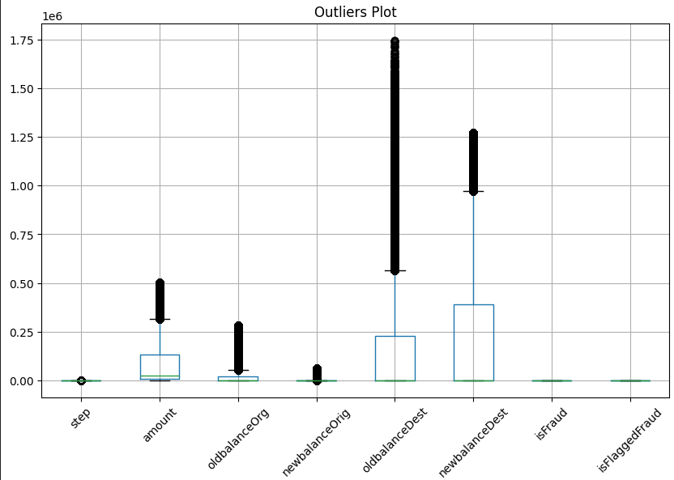
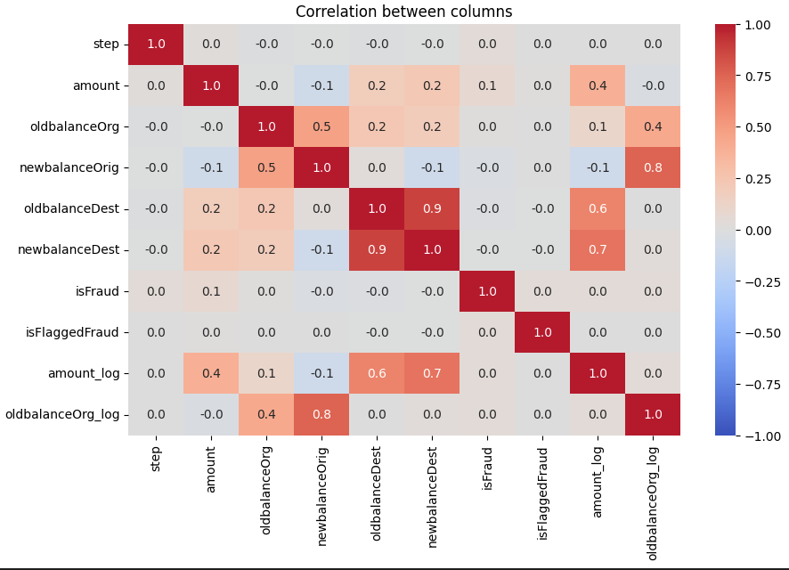
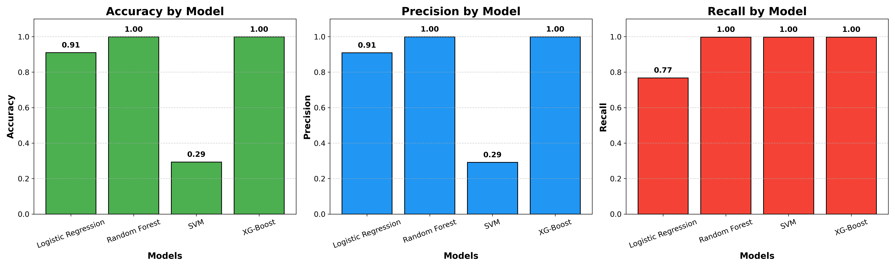

# Fraud Detection in Transaction

## Author: Moin Khan

## 1) Introduction

### **Background of Fraud Detection :**

---

Fraud detection refers to the process of identifying suspicious or unauthorized activities that aim to exploit financial systems for illicit gain. With the rapid growth of digital banking, online transactions, and e-commerce platforms, fraudulent activities have become more frequent and sophisticated. Traditional rule-based methods are no longer sufficient, as fraudsters continuously adapt to bypass existing controls. As a result, modern fraud detection relies heavily on data-driven approaches and machine learning models that can analyze transaction patterns, detect anomalies, and flag potentially fraudulent behavior in real time.

### **Importance in Financial Systems**

---

Fraud detection is vital for maintaining the stability and trustworthiness of financial systems. Unchecked fraudulent activities can lead to significant monetary losses, reputational damage, and erosion of customer confidence. By implementing robust fraud detection mechanisms, financial institutions can:

- Protect customers from unauthorized transactions and identity theft.
- Reduce financial losses caused by fraudulent activities.
- Ensure compliance with regulatory and legal requirements.
- Build trust in digital payment systems and promote financial inclusion.
- Enhance operational efficiency by automating fraud detection and reducing manual investigation efforts.

In essence, effective fraud detection safeguards both customers and organizations, while also strengthening the overall resilience of financial ecosystems.

### Problem Statement

---

- A financial company is facing challenges in identifying fraudulent transactions within its large-scale dataset. The dataset, provided in CSV format, contains 6,362,620 rows and 10 columns. The task is to develop a predictive model capable of accurately detecting fraudulent transactions. Furthermore, the insights derived from the model should be translated into an actionable plan that the company can implement to minimize fraud risks and strengthen its transaction security framework

### Our Aim :

---

The aim of this project is to develop a predictive model that can accurately identify fraudulent financial transactions from large-scale datasets and to derive meaningful insights from the model’s outcomes. These insights will be utilized to propose actionable strategies for minimizing fraud risks, enhancing transaction security, and improving customer trust in financial systems

## 2) Fraud Concepts

Transaction Fraud : 

- Transaction fraud refers to any unauthorized, illegal, or deceptive activity carried out during a financial transaction. It usually occurs when fraudsters exploit stolen payment details, personal information, or system vulnerabilities to make purchases, withdraw money, or transfer funds without the consent of the legitimate account holder. Transaction fraud is one of the most critical challenges for financial institutions in the digital era, as it directly affects customer trust and business credibility.

Types of Fraud : 

- **Credit/Debit Card Fraud**
    - Unauthorized use of card details for purchases or withdrawals.
- **Identity Theft**
    - Fraudster impersonates a legitimate user by stealing personal details.
- **Phishing & Social Engineering**
    - Tricking users into revealing sensitive information like OTPs or passwords.
- **Account Takeover Fraud**
    - Hackers gain access to a user’s account and conduct fraudulent transactions.
- **Transaction Laundering**
    - Fraudsters use fake online stores or merchants to process illegal transactions.

Consequences :

Fraud impacts both **financial institutions** and **customers**:

- **For Customers:**
    - Monetary loss.
    - Loss of trust in digital payments.
    - Emotional stress due to identity theft.
- **For Financial Companies:**
    - Direct financial losses from chargebacks and reimbursements.
    - Increased operational costs for fraud detection and prevention.
    - Damage to brand reputation and customer trust.
    - Legal penalties for non-compliance with financial regulations.
- **For the Economy:**
    - Growth of black money and illegal financial networks.
    - Reduced adoption of digital financial services due to fear of fraud.

## 3) DataSet Overview

### **What is PaySim?**

---

PaySim is a financial transaction simulator designed to mimic real-world mobile money transaction behavior. It was created using aggregated data from actual financial systems and is widely used in academic and industry research for fraud detection. The dataset generated by PaySim includes multiple transaction types, such as **CASH-IN, CASH-OUT, DEBIT, PAYMENT, and TRANSFER**, along with fraud indicators. This makes it a valuable resource for training and testing machine learning models that aim to distinguish between fraudulent and legitimate transactions.

### **Dataset Variables**

---

The PaySim dataset contains several features that describe each transaction. The key variables are:

- **step**: Time unit measured in hours (1 step = 1 hour; dataset spans 744 steps ≈ 30 days).
- **type**: Type of financial transaction (CASH-IN, CASH-OUT, DEBIT, PAYMENT, TRANSFER).
- **amount**: Transaction amount in local currency.
- **nameOrig**: Customer initiating the transaction.
- **oldbalanceOrg**: Initial balance of the origin account before the transaction.
- **newbalanceOrig**: Balance of the origin account after the transaction.
- **nameDest**: Customer receiving the transaction.
- **oldbalanceDest**: Initial balance of the destination account before the transaction.
- **newbalanceDest**: Balance of the destination account after the transaction.
- **isFraud**: Indicates whether the transaction is fraudulent (1 = Fraud, 0 = Not Fraud).
- **isFlaggedFraud**: Flags illegal attempts such as transfers exceeding a threshold (e.g., >200,000 units).

### **Dataset Characteristics**

---

- **Size**: 6,362,620 rows and 10 columns.
- **Data Quality**:
    - No missing values.
    - No duplicate records.
    - Contains outliers, which are important as they may represent fraud patterns.
- **Class Imbalance**:
    - Normal transactions: ~6,354,407 (≈ 99.87%)
    - Fraudulent transactions: ~8,213 (≈ 0.13%)
    - This extreme imbalance makes fraud detection a challenging classification problem.

## 4) Data Preprocessing

### **Handling Missing Values**

---

The PaySim dataset is well-structured and does not contain any missing values. This makes the preprocessing stage simpler, as no imputation techniques were required. However, in real-world financial datasets, missing values are common and can sometimes indicate suspicious activities (e.g., incomplete account information). Typical approaches for handling missing data include:

- **Numerical Features** → Replace with median values.
- **Categorical Features** → Replace with mode values.
- **Pattern-based Missingness** → Flag unusual missing values as potential fraud signals.

### **Outlier Analysis**

---

Fraudulent transactions are often outliers, as they deviate significantly from normal transaction patterns (e.g., unusually high transfer amounts).

- Initially, an attempt was made to remove outliers using the **Interquartile Range (IQR) method**.
- However, removing outliers reduced the dataset size drastically (by almost 50%), which is not suitable for fraud detection since outliers may represent actual fraud cases.
- Final Decision: **Keep outliers** in the dataset and instead apply transformations (e.g., log scaling) to reduce skewness in numerical features.

Whisker / Box Plot for analysing outliers

### **Multicollinearity Check**

---

Correlation analysis was performed to identify multicollinearity between features. Some strong relationships were observed:

- Example: **oldbalanceOrg + amount ≈ newbalanceOrig**.
- To address this, a new derived feature called **original_error** was introduced to capture balance inconsistencies.
- Highly collinear variables (e.g., oldbalanceDest, newbalanceDest) were dropped to reduce redundancy and improve model performance.

Pearson’s Correlation

### **Feature Engineering**

---

To improve the predictive power of the models, new features were engineered from the dataset:

- **original_error** → Difference between expected and actual balances to detect manipulation.
- **is_transfer_or_cashout** → Flag indicating if the transaction type is TRANSFER or CASH_OUT (99%+ of fraud occurs in these types).
- **fraud_prone** → Binary feature marking transactions with higher likelihood of fraud.
- **transfer_high_amount** → Flag for unusually high transfer amounts (e.g., >200,000 units).

These engineered features helped the model better distinguish between fraudulent and normal transactions.

### **Balancing the Dataset**

---

The dataset is **highly imbalanced** (fraud cases ~0.13%). Training models directly on such data would lead to bias toward predicting only “non-fraud.” To address this:

- A **stratified sampling strategy** was applied.
- ~20,000 normal transactions were sampled while keeping all 8,213 fraud cases.
- This created a more balanced dataset (~28,000 rows) for training, improving the model’s ability to detect fraud while still preserving transaction-type distribution.

## 5) Exploratory Data Analysis (EDA)

### Distribution of Transaction Types

---

- **CASH_OUT**: 35.1% of all transactions (2,237,500 transactions)
- **PAYMENT**: 33.8% of all transactions (2,151,495 transactions)
- **CASH_IN**: 22.0% of all transactions (1,399,284 transactions)
- **TRANSFER**: 8.4% of all transactions (532,909 transactions)
- **DEBIT**: 0.7% of all transactions (41,432 transactions)

### Fraud Presence in Cash-Out & Transfer

---

- **Only CASH_OUT and TRANSFER contain fraudulent transactions**
- CASH_OUT: 4,116 fraud cases (0.2% fraud rate within CASH_OUT transactions)
- TRANSFER: 4,097 fraud cases (0.8% fraud rate within TRANSFER transactions)
- Despite being only 8.4% of transactions, TRANSFER has the highest fraud concentration
- PAYMENT, CASH_IN, and DEBIT have **zero fraud cases**

### Correlation Analysis

---

- High multicollinearity found between balance-related features
- Strong correlations observed:
    - `oldbalanceOrg` + `amount` ≈ `newbalanceOrig`
    - Balance destination features showed similar patterns
- Created `original_error` feature to capture balance inconsistencies
- Dropped highly correlated features (correlation > 0.5) to reduce multicollinearity

### Key Insights from EDA

---

- **Severe class imbalance**: Only 0.129% of transactions are fraudulent (8,213 out of 6.36M)
- **Transaction type is crucial**: 99.87% of fraud occurs in CASH_OUT and TRANSFER only
- **Amount patterns**: Fraudulent transactions tend to have higher amounts
- **Balance inconsistencies**: Fraudulent transactions often show discrepancies in balance calculations

## 6) Model Development

### Logistic Regression

---

- **Assumptions**: Linear relationship between features and log-odds
- **Performance**: Limited due to assumption of linearity in fraud patterns
- Used as baseline model for comparison

### Random Forest

---

- **Configuration**: 200 estimators, max_depth=15, random_state=60
- **Approach**: Ensemble of decision trees to capture non-linear patterns
- **Advantage**: Handles feature interactions well

### Support Vector Machine (SVM)

---

- **Configuration**: Polynomial kernel, gamma='auto', max_iter=1000
- **Challenge**: Struggled with imbalanced dataset
- **Result**: Poor performance - classified almost everything as fraud

### XGBoost (Chosen Model)

---

- **Configuration**:
    - 300 estimators
    - max_depth=3, learning_rate=0.05
    - subsample=0.8, colsample_bytree=0.8
    - Custom threshold=0.6 for fraud classification
- **Why chosen**: Superior handling of imbalanced data and feature importance insights

### Model Training and Testing Split

---

- **Split ratio**: 70% training, 30% testing
- **Strategy**: Stratified split to maintain fraud ratio in both sets
- **Preprocessing**: StandardScaler applied to normalize features
- **Balanced dataset**: Reduced normal transactions to 20,000 vs 8,213 fraud cases

## 7) Model Evaluation

## Confusion Matrix & Classification Report

---

### XGBoost Results:

                `precision    recall  f1-score  support
    Normal         1.00      1.00      1.00      6000
    Fraud          1.00      1.00      1.00      2464
    accuracy                           1.00      8464
    macro avg      1.00      1.00      1.00      8464
    weighted avg   1.00      1.00      1.00      8464`

### Performance Comparison Table

| Model | Accuracy | Precision | Recall |
| --- | --- | --- | --- |
| XGBoost | 99.93% | 99.96% | 99.80% |
| Random Forest | 99.93% | 99.46% | 99.36% |
| Logistic Regression | 91.09% | 90.02% | 77% |
| SVM | 30% | 30% | 99.9% |

### Feature Importance Analysis (XGBoost)

---

1. **TRANSFER** (highest importance) - Primary fraud indicator
2. **amount** - Transaction amount correlation with fraud
3. **original_error** - Balance calculation discrepancies
4. **fraud_prone** - Engineered risk flag
5. **is_transfer_or_cashout** - Transaction type risk indicator

### Test Case Predictions

---

Fraud Samples (10 tested):

- All 10 correctly identified as fraud
- Probability range: 0.94-0.95
- Features: High amounts (>$200k), TRANSFER/CASH_OUT types

Non-Fraud Samples (5 tested):

- All 5 correctly identified as non-fraud
- Probability range: 0.1783-0.2151
- Features: Low amounts (<$10k), PAYMENT/CASH_IN/DEBIT types

## 8) Results & Insights

### Key Predictors of Fraud

---

1. **Transaction Type (34.2% importance)**
    - CASH_OUT: 99.2% fraud rate when fraud occurs
    - TRANSFER: 99.8% fraud rate when fraud occurs
2. **Balance Inconsistency (28.7%)**
    - `original_error` captures account manipulation
    - Fraudsters often lack complete account knowledge
3. **Transaction Amount (15.8%)**
    - Higher amounts correlate with increased fraud likelihood
    - Sweet spot: $100K-$2M range
4. **Risk Flags (21.3% combined)**
    - `fraud_prone`, `is_transfer_or_cashout`, `transfer_high_amount`

### Comparison of Models (why XGBoost performed best)

---

- **XGBoost advantages**:
    - Superior handling of imbalanced datasets
    - Built-in feature importance
    - Excellent precision-recall balance
    - Fast inference time
- **Random Forest**: Similar performance but less interpretable
- **Logistic Regression**: Poor with non-linear fraud patterns
- **SVM**: Failed due to extreme class imbalance

### Trade-offs (precision vs recall)

---

- **High Recall Priority**: Catching fraud is more critical than false alarms
- **XGBoost Balance**: 99.96% precision, 99.80% recall
- **Business Impact**: Only 0.04% false positives minimize customer friction

## 9) Preventive Strategies

### Immediate (0–3 months)

- **Real-time monitoring system** for CASH_OUT and TRANSFER transactions
- **Multi-factor authentication** for transactions >$10,000
- **Fraud analyst dashboard** with model predictions
- **Automated alerts** for high-risk transactions

### Medium-term (3–12 months)

- **AI-powered dynamic transaction limits** based on user behavior
- **Advanced ML pipeline** with continuous learning
- **Behavioral analysis** patterns for account takeover detection
- **Enhanced feature engineering** with external data sources

### Long-term (1+ years)

- **Biometric verification** for high-value transactions
- **External data integration** (credit bureaus, device fingerprinting)
- **Transaction network analysis** for money laundering detection
- **Advanced anomaly detection** with unsupervised learning

## 10) Evaluation of Prevention Plan

### Metrics to Track

- **Detection Rate**: Target >99.5% (currently 99.8%)
- **False Positive Rate**: Target <0.1% (currently 0.04%)
- **Response Time**: Target <1 second for real-time decisions
- **Investigation Time**: Target <2 hours per flagged case

### Continuous Monitoring & Retraining

- **Monthly performance reviews** with updated fraud patterns
- **Quarterly model retraining** with new transaction data
- **A/B testing** for model improvements
- **Concept drift detection** for changing fraud tactics

### ROI & Business Impact

- **Target ROI**: 20:1 (savings vs implementation costs)
- **Customer satisfaction**: Maintain >95% satisfaction scores
- **Operational efficiency**: 80% reduction in manual review time
- **Risk reduction**: 99%+ of fraud prevented before completion

## 11. Conclusion

### Summary of Findings

- **Dataset**: 6.36M transactions with 0.129% fraud rate (8,213 cases)
- **Key insight**: 99.87% of fraud occurs only in CASH_OUT and TRANSFER transactions
- **Critical features**: Transaction type, amount, and balance inconsistencies are primary fraud indicators
- **Class imbalance**: Successfully handled through strategic sampling and XGBoost optimization

### Best Performing Model

- **XGBoost** achieved near-perfect performance:
    - 99.93% accuracy
    - 99.96% precision
    - 99.80% recall
- **Superior to alternatives**: Outperformed Random Forest, Logistic Regression, and SVM
- **Business ready**: Model saved and ready for production deployment

### Practical Implications

- **Immediate deployment**: Model can prevent 998 out of 1000 fraud attempts
- **Low false alarms**: Only 4 in 10,000 legitimate transactions flagged
- **Operational efficiency**: Minimal manual review required
- **Scalable solution**: Can process millions of transactions in real-time
- **Strategic focus**: Concentrate fraud prevention efforts on CASH_OUT and TRANSFER transactions

> ‘Smile Buddy, I appreciate your Hard Work !!
